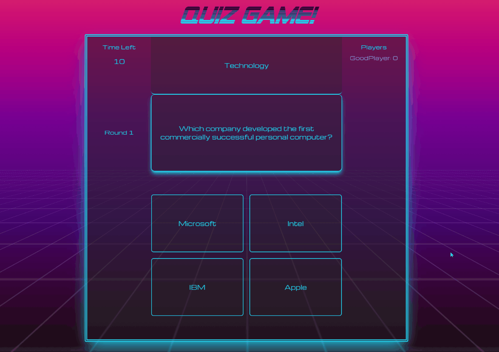

# QuizGame - challenge for you and your friends
---------
## Introduction

Get into game solo or with up to 5 friends and check your knowledge about various topics! Each of 10 rounds has limited time so act fast, but if you can get correct answer three times in row you'll become "on fire" and everyone will see who rocks! Score multiplies with every passed round, even if you fall back early, there's still a chance to get back in game when your opponent slips up!

---
## Features

- Play solo or with group up to 5 friends
- Each round has time limit with indicator when time is close to end, no pressure :)
- Each lobby has unique invitation code, and when game ends you can quickly play again with the same players without need to invite everyone again
- Answer correctly, get into streaks and show superiority over your opponents!

---
## Preview


## Used Technologies

- .NET
- EF Core
- SignalR
- ReactJS
- Tailwind
- PostgreSQL

---
## To Do:

- [x] Add visual indicator when time is about to run out
- [x] Add visual info which players selected answer in current round
- [ ] Public lobbies, so you can play with random players
- [ ] Quick-Shots game mode - less time for answer and score multiplies with how fast you answer
- [ ] Question uploader website
- [x] Replayable lobbies

---
## Getting Started

## Prerequisites

Developed and tested on

- Node.js - version 18.16.0
- Yarn - version 1.22.19
- .NET 6.0
- PostgreSQL

You can replace Yarn with NPM or PNPM

### First step is to run front:
To install yarn use:
```
yarn install
```
Make sure that WebSocket URL path in connection.ts file is set correctly, then:

Use:
```
yarn dev
```
to launch it in development mode, or:
```
yarn build
```
and then:
```
yarn preview
```
to run production version.
### Second step is to run back
You can find all instructions in backend repo [here](https://github.com/mglgw/quizgame-backend).

### And that's it! You are ready to go and solve quiz of your own making! GLHF!